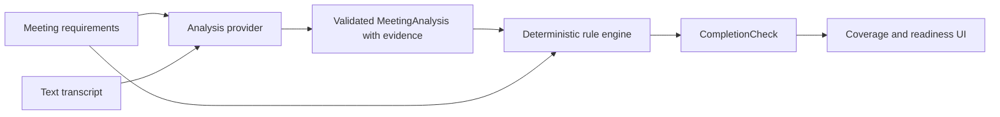

# MeetDone

**Know if your meeting is actually done. / 确认你的会议是否真正完成。**

MeetDone checks predefined goals, conclusions, topics, relevant speaker input, explicit decisions, and accountable actions **before a meeting ends**. The central interaction is **准备结束会议 / Prepare to End Meeting**.

## Primary input: text transcript

Type or paste meeting discussion, or load a built-in demo transcript. Text is the sole input in this phase. There is no audio/video/recording upload or live microphone input.



The LLM extracts and classifies facts. It never decides readiness, grants exceptions, or authorizes ending. The existing deterministic rule engine remains the only source of readiness decisions. No authentication or database has been added.

## Run locally

Requires Node.js 20.9+ and npm; verified with Node 24.

```sh
npm ci
npm run dev
```

Open [localhost:3000](http://localhost:3000). The preloaded demo works without environment variables or API credentials.

## Exact DeepSeek configuration

Create **`.env.local` in the project root, alongside `package.json`**. In this workspace the exact path is:

```text
C:\Users\32609\Documents\Documents\meetdone\.env.local
```

Copy `.env.example` to `.env.local`, then fill in your own key:

```dotenv
DEEPSEEK_API_KEY=your_real_deepseek_api_key_here
DEEPSEEK_BASE_URL=https://api.deepseek.com
DEEPSEEK_MODEL=deepseek-chat
```

`DEEPSEEK_API_KEY` is required for AI analysis. The URL and model shown above are also the runtime defaults if those two variables are omitted. Use plain URLs, without Markdown brackets. **Restart the local development server after adding or changing `.env.local`**: stop it with Ctrl+C, then run `npm run dev` again.

The key is read only by `lib/server/deepseek-provider.ts` using `process.env.DEEPSEEK_API_KEY`. This module imports `server-only`. The browser calls `/api/analyze-meeting`, never DeepSeek directly. Do not create `NEXT_PUBLIC_DEEPSEEK_API_KEY`. `.env.local` is ignored by Git; `.env.example` contains no real key and is explicitly allowed in `.gitignore`.

## Vercel configuration

1. Import the repository as a **Next.js** project. Use the project root and build command `npm run build`.
2. Open **Project → Settings → Environment Variables**.
3. Add the following three variables. Select **Production** and **Preview**, plus **Development** if you use Vercel's local environment tooling.

   | Name                | Value                      |
   | ------------------- | -------------------------- |
   | `DEEPSEEK_API_KEY`  | Your real DeepSeek API key |
   | `DEEPSEEK_BASE_URL` | `https://api.deepseek.com` |
   | `DEEPSEEK_MODEL`    | `deepseek-chat`            |

4. Keep the API key private; mark it sensitive where the dashboard supports this. Do not use any `NEXT_PUBLIC_` prefix.
5. **Deploy or redeploy** after saving/changing the variables. Existing deployments do not pick up new values automatically. See [Vercel environment variable management](https://vercel.com/docs/environment-variables/managing-environment-variables).

The API route uses the Node.js runtime, declares a 60-second function duration, and times out upstream requests after 45 seconds. Your Vercel plan must support that duration. No database or additional service deployment is required.

## Provider architecture

- **`AnalysisProvider`** retains the `analyze(input)` boundary and accepts synchronous or asynchronous providers. Its input contains only requirements, transcript/version, and template ID. Required speakers and action outputs are already included in the requirement array.
- **`MockAnalysisProvider`** returns fixed fixtures for exact, unchanged demo transcripts. It does not infer analysis for arbitrary custom text or changed requirement meanings.
- **`DeepSeekAnalysisProvider`** is a server-side OpenAI-compatible chat-completions adapter. It accepts a configurable HTTPS base URL/model and uses JSON output. See [DeepSeek JSON output documentation](https://api-docs.deepseek.com/guides/json_mode/).
- **`POST /api/analyze-meeting`** validates input, calls the provider, and returns `MeetingAnalysis` or a safe error code. It does not return a model-generated `CompletionCheck`.
- **Client state** stores validated analysis and runs the existing rule engine. Responses from an older transcript, requirement revision, or changed meeting state are rejected. Edits never silently reuse a stale readiness result.

The UI uses the generic analysis endpoint and distinguishes AI from demo mode. It does not import the DeepSeek implementation. Another compatible provider can use the same contract without changing the readiness rules.

### Structured extraction and evidence

Zod validates both the provider output and the normalized application model. The extraction schema rejects extra readiness fields.

- Required decisions are classified as `not_discussed`, `discussed_not_decided`, or `decided`. The adapter preserves this classification and maps it to the existing rule engine's `missing`, `discussed`, or `decided` status. Decided outcomes require evidence and a nonempty outcome.
- Speaker classifications distinguish `not_mentioned`, `present_no_opinion`, and `expressed_opinion`, mapped to the existing coverage statuses. Another person's quote cannot satisfy the required speaker's opinion.
- Positive coverage, actions, and unresolved issues require evidence. Quotes must exist verbatim on the cited transcript line, and speaker attribution is checked against that line.
- Owners and deadlines are `null` when absent or unsupported. Each populated value requires its own supporting evidence reference. Deadlines must be explicitly stated ISO dates (`YYYY-MM-DD`); relative deadlines are left unknown rather than guessed. Unstated action status is displayed as unknown.
- Missing findings are normalized to missing, never complete. Summary decisions and conclusions come from validated analysis; actions and exceptions may also contain explicit host input.

Evidence checks establish that text exists in the transcript. They cannot prove that every semantic interpretation is correct; the host can inspect excerpts before ending.

### Limits and failures

- Transcript: **30–30,000 characters**; request body: **180,000 bytes** maximum.
- Requirements: **80 total**, with labels up to **500 characters**.
- One request per button click, no automatic retries; output capped at 8,000 tokens.
- Upstream timeout: **45 seconds**; client timeout: **55 seconds**.
- Empty/short/long transcripts, missing credentials, timeout, provider errors, malformed output, and unsupported evidence all produce localized messages.
- Errors do not discard saved transcript text or replace it with invented analysis. The user can retry or select a demo scenario and choose **使用演示分析 / Use Demo Analysis**.

No durable rate limiter or authentication is included in this take-home MVP. A public deployment's AI endpoint can be invoked by visitors; transcript/output limits bound individual requests, not total account spend.

## Bilingual UI

**Simplified Chinese is the default.** Use **中文 / EN** in the header. The preference is stored under `meetdone.language`, survives reloads, and synchronizes between tabs.

`lib/i18n.ts` is the central UI dictionary; `components/language-provider.tsx` is a small subscription-based language layer. UI messages, validation/errors, template names/descriptions, and built-in requirement/default text have both languages. The document language and title update as well.

Built-in defaults carry provenance (`builtinKey` / `builtinTitle`), so they can display in either language without rewriting the underlying meeting. Editing a default removes that provenance. User-entered titles, requirements, transcripts, opinions, decisions, action descriptions, and exception reasons are **never automatically translated**. Transcript quotes and extracted details stay in their source language. The supplied demo transcripts/evidence remain their original English examples.

## Dynamic requirements

The existing `MeetingRequirements.items: Requirement[]` discriminated array is preserved. Goals, conclusions, topics, speaker inputs, and action outputs are dynamic views over it, with stable unique IDs. There are no numbered fields or duplicated collections.

Every section has **Add item** and **Remove** controls. The five required list types must each contain at least one item. The final remove button is disabled, and state/server validation enforces the same minimum. Decisions and agenda also support dynamic entries. Required, recommended, record-only, and explicit deferral policies are retained.

Saving added/deleted/edited requirements increments the revision and clears analysis and completion results. Unsaved edits prevent ending checks until saved or discarded. Transcript edits immediately invalidate analysis and completion; action edits invalidate the completion check. New requirement IDs persist in localStorage.

The workspace envelope is version 2 under the existing `meetdone.workspace.v1` key so Phase 1 data can be read and migrated. Legacy active lists missing a required type receive a default entry and their analysis is invalidated. Malformed storage falls back safely to a fresh demo; storage failures keep in-memory work and show a warning.

## Reviewer walkthrough and demo fallback

1. Click **体验演示会议 / Try Demo Meeting**. Product Launch Scenario A is preloaded and analyzed.
2. Click **准备结束会议 / Prepare to End Meeting**. Inspect the four blockers: no Sales opinion, no final Go / No-Go, a missing owner, and a missing deadline.
3. Edit action ownership/dates and recheck. A follow-up cannot erase a non-deferrable decision blocker.
4. Open **会议文本 / Transcript**, load **场景 B / Scenario B**, then click **使用演示分析 / Use Demo Analysis**.
5. Prepare to end again, then generate the summary.
6. Reset Demo and try **带例外结束 / End with Exception**. A reason is mandatory; readiness remains blocked.

Retrospective and Customer Progress templates also have complete demo examples with recommended follow-ups. Demo mode never requires an API key. Loading a scenario explicitly replaces transcript text; merely pressing the fallback button on a custom transcript does not overwrite it. Changed custom requirements may remain uncovered by a demo fixture, as they should.

## Test a custom transcript

1. Configure `.env.local` and restart the dev server.
2. Open the launch demo (or create a meeting and define its requirements).
3. Open **会议文本 / Transcript**, paste a speaker-labeled transcript, and click **分析会议 / Analyze Meeting**.
4. Check **AI 分析模式 / AI Analysis Mode**, coverage, exact evidence, decisions, and nullable action fields. Readiness updates through the deterministic rules.
5. Click **准备结束会议 / Prepare to End Meeting** before ending. Editing the text requires a fresh analysis.

Example for the default Product Launch requirements:

```text
Maya · Product: 我们今天评估 Atlas 的产品、工程和销售发布准备情况，并决定是否发布。产品的引导流程和上线文案已完成，我支持发布。
Alex · Engineering: 工程已通过压力测试，可以发布。我们讨论了上线风险；回滚流程和现场值班已安排好，可以应对主要风险。
Jordan · Sales: 销售培训已完成，客户沟通材料已准备好。我代表销售支持本次发布。
Maya · Product: 三方确认发布准备情况满足要求。最终决定是 Go，Atlas 于 2026-09-25 发布。
Maya · Product: 由 Jordan 负责发送发布公告，截止日期是 2026-09-24。
Alex · Engineering: Alex 负责发布上线监控清单，截止日期是 2026-09-24。
```

## File structure

```text
app/
  page.tsx, meetings/[id]/page.tsx      Two main product routes
  api/analyze-meeting/route.ts         Server-only analysis endpoint
components/
  language-provider.tsx              Persistent Chinese/English UI
  transcript-panel.tsx               AI analysis, loading, errors, demo fallback
  requirements-editor.tsx            Dynamic lists and minimum counts
  meeting-workspace.tsx              Workflow orchestration
  meeting-presentation.ts            Localized system gaps; untouched user content
  home.tsx, create-meeting.tsx        Bilingual entry and setup
  coverage.tsx, action-items.tsx      Evidence and commitments
  gap-check.tsx, meeting-summary.tsx  End checks, exceptions, summaries
  workspace-store.tsx, shared.tsx     Local workspace and shared UI
  ui/                               shadcn/ui components
lib/
  models.ts, templates.ts, demo.ts   Typed models and built-in fixtures
  i18n.ts, requirements.ts           Dictionaries and dynamic-list constraints
  analysis-contract.ts               Input limits, schema, safe error codes
  analysis-provider.ts               Provider interface and MockAnalysisProvider
  analysis-client.ts                 Generic browser API client
  server/deepseek-provider.ts        Private DeepSeek adapter and environment config
  server/extraction.ts               Prompt, output schema, evidence validation
  rule-engine.ts                     Deterministic readiness, preserved
  meeting-state.ts, storage.ts        Invalidation, persistence, migration
tests/, e2e/                         Unit, route, provider, and browser tests
.env.example                         Public variable names and defaults only
```

## Verification

```sh
npm run lint
npm run typecheck
npm test
npm run build
npx playwright install chromium
npm run test:e2e
```

If the browser download is unavailable, use installed Chrome. PowerShell:

```powershell
$env:PLAYWRIGHT_CHANNEL = 'chrome'
npm run test:e2e
```

Browser tests start the production server; build first. Provider/route tests mock upstream HTTP; browser AI-success/failure tests mock the application endpoint. They validate contracts and UX without spending API credits. A live DeepSeek call requires your real API key and is not part of the automated suite.

## Known limitations and future integrations

- AI may misinterpret discussion even when its quoted evidence is real. Inspect important decisions and speaker input.
- Speaker-labeled text and explicit ISO dates give the most reliable results. Unattributed speech and relative dates remain conservative/unknown.
- localStorage is browser/origin-specific; there is no shared workspace, cross-device sync, authentication, or database. Concurrent tabs use the latest stored workspace.
- Ended meetings preserve their state. Demo reset affects only the preloaded launch meeting.
- No audio upload, video upload, screen recording upload, live microphone streaming, Zoom, Microsoft Teams, or Google Meet integration.
- Future audio/live integrations would add **Audio / Live Meeting → Speech-to-Text → Transcript → Existing Analysis Pipeline**. They do not require moving readiness rules into the LLM.
